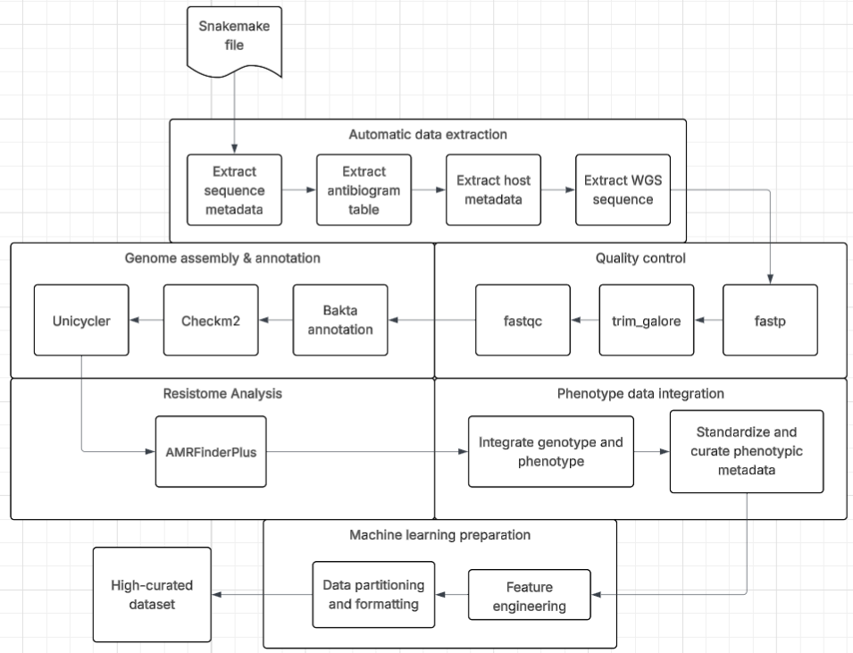

# gast_project

This repository implements an automated pipeline for retrieving, processing, and integrating public sequencing data and metadata for *Klebsiella pneumoniae*. The workflow produces a curated dataset suitable for downstream machine-learning applications.

The pipeline is structured into four phases:
1. Data extraction  
2. Data cleaning and annotation  
3. Data integration  
4. Data preparation for machine learning  

## Inputs and Outputs

**Input**
- User-defined configuration parameters
- Sufficient compute resources (minimum: 8 CPU cores)

**Output**
- A curated dataset integrating:
  - Draft genomes
  - Detected antimicrobial resistance genes
  - Antibiotic susceptibility data
  - Source of bacterial isolates and isolate metadata


## System Requirements

- Python environment compatible with the packages in `requirements.txt`
- At least 8 CPU cores for <10 samples
- 16 or more CPU cores recommended for larger datasets
- Internet access for database downloads and NCBI retrieval

## Step-by-Step Setup and Execution

### 1. Clone the Repository

```bash
git clone <repository_url>
cd gast_project
````

### 2. Install Python Dependencies

Install all required packages listed in `requirements.txt`:

```bash
pip install -r requirements.txt
```

### 3. Prepare Reference Databases

#### 3.1 Bakta Database

```bash
wget https://zenodo.org/record/14916843/files/db-light.tar.xz
mkdir -p bakta_db
tar -xf db-light.tar.xz -C bakta_db
mv bakta_db/db-light/* bakta_db/
rmdir bakta_db/db-light
```

#### 3.2 CheckM2 Database

```bash
wget https://zenodo.org/record/5571251/files/checkm2_database.tar.gz
mkdir -p checkm2_db
tar -xzf checkm2_database.tar.gz -C checkm2_db
mv checkm2_db/CheckM2_database/* checkm2_db/
rmdir checkm2_db/CheckM2_database
```

#### 3.3 AMRFinderPlus Database

The AMRFinderPlus database is managed automatically by Snakemake.
A file named `amrfinder_db_ready.txt` indicates a current database state.
Deleting this file forces a database update during the next run.

### 4. Initialize Project Structure

Run the setup script to create the required directory layout:

```bash
python setup_gast.py
```

---

## Configuration Parameters

All executions require a configuration file named `config_parameter.yaml`.

Mandatory fields:

* `retmax`: number of samples to retrieve
* `email`: contact email for NCBI queries
* `organism`: default is *Klebsiella pneumoniae*

These can be configured via Graphical User Interface (GUI) or manual. Below are either of these scenario's described

---

## Path A: Execution via Graphical User Interface (GUI)

### 5A. Launch the GUI

```bash
streamlit run gui.py
```
This may take some time.

### 6A. Configure Parameters in the GUI

* Enter all required parameters directly in the interface.
* The GUI automatically generates `config_parameter.yaml`.

### 7A. Run the Pipeline

* Press the **Run workflow** button.
* Snakemake is launched internally using the generated configuration.
* No manual configuration file editing is required.

## Path B: Execution via Command Line (Terminal)

### 5B. Create the Configuration File

* Copy `config_parameter_example.yaml`.
* Rename it to `config_parameter.yaml`.
* Edit all fields exactly as required.
    * Any deviation from the template format will prevent execution.

### 6B. Run the Pipeline Manually

```bash
snakemake --cores <number_of_cores> --use-conda --latency-wait <time in seconds>
```

---

## Workflow Overview

The pipeline performs the following operations in sequence:

1. Retrieval of source of bacterial isolates and sample metadata and raw sequencing reads
2. Adapter trimming with Trim Galore
3. Quality assessment with FastQC
4. Draft genome assembly with Unicycler
5. Genome annotation using Bakta
6. Genome quality assessment with CheckM2
7. Detection of resistance and associated genes using AMRFinderPlus
8. Integration of genomes, resistance profiles, and metadata into a unified CSV
9. Dataset standardization, encoding, and partitioning for machine learning

Multiple validation checkpoints allow documentation of failed isolates, with emphasis on carbapenem phenotype breakpoints and genome completeness.

---

## Bioinformatics Tools Used
* **Trim Galore**
  Adapter and low-quality base trimming.

* **FastQC**
  Quality assessment of raw sequencing reads.

* **Unicycler**
  Short-read bacterial genome assembly (long-read support available).

* **Bakta**
  Automated annotation of bacterial draft genomes.

* **CheckM2**
  Genome completeness and contamination assessment.

* **AMRFinderPlus**
  Identification of antimicrobial resistance genes, stress-response genes, and selected virulence factors.

<p align="center">  </p>

---

## Light version

Use `Snakefile_light.smk` if you only require the final dataset. This version minimizes storage usage by creating temporary intermediate tool outputs. It will only save the downloaded raw data, consistency check reports and the final ML-ready datasets.


## Other bacterial species

While the pipeline defaults to Klebsiella pneumoniae, its modular design allows for easy adaptation to other bacterial species. Adjust the organism from **Klebsiella pneumoniae** to the preferred species. This must align with the naming convention used in NCBI and with the availability of sequencing reads through the SRA Extractor. If another option is required in the GUI, add the additional species to the SelectBox list in the **GUI.py** script. This option must correspond directly to the official NCBI bacterial species name as well.


